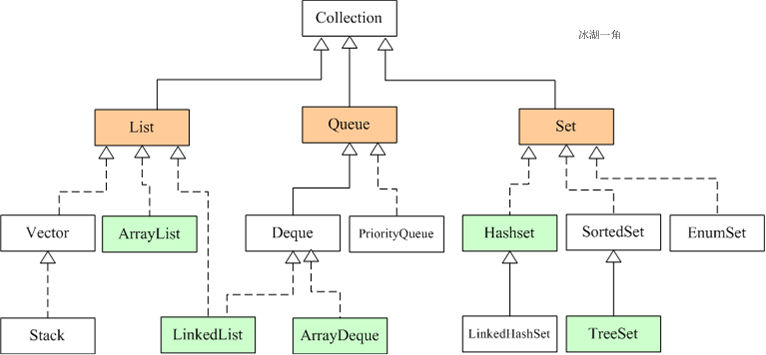
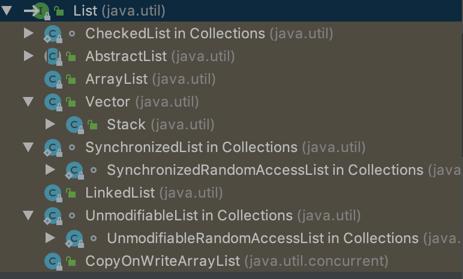

# 以下是Java中常用的数据结构的基础知识



Java集合类主要由两个根接口`Collection`和`Map`派生出来的，`Collection`派生出了三个子接口：`List`、`Set`、`Queue`（Java5新增的队列）

因此Java集合大致也可分成`List`、`Set`、`Queue`、`Map`四种接口体系，（注意：Map不是Collection的子接口）

其中List代表了有序可重复集合，可直接根据元素的索引来访问；Set代表无序不可重复集合，只能根据元素本身来访问；

Queue是队列集合；Map代表的是存储key-value对的集合，可根据元素的key来访问value

上图中淡绿色背景覆盖的是集合体系中常用的实现类，分别是`ArrayList`、`LinkedList`、`ArrayQueue`、`HashSet`、`TreeSet`、`HashMap`、`TreeMap`等实现类

# 1 List家族
List<E>接口继承图：



`JDK`中的List家族主要包括了`ArrayList`、 `LinkedList`、`Vector`、`CopyOnWriteArrayList`、`UnmodifiableList` 、`SynchronizedList`

## 1.1 List

List集合是有序的，Developer可对其中每个元素的插入位置进行精确地控制，可以通过索引来访问元素，遍历元素

List类在Java.awt包里，List<E>在java.util包里,但使用时是用List\<E>

因为List是列表，本质上是一个数组，没有类型，使用List\<E>泛型主要为了列表的数据类型

### 1.1.1 代码方法实战

```java
   void demo_1(){
        //实例化List
        List<String> list = new ArrayList<>();
        //实例化直接赋值
        List<String> list1 = Arrays.asList("a","c","m","d");
        //添加元素
        list.add("a");
        System.out.println("demo_1添加 a 后输出list:"+list);//output:[a]
        list.add("b");
        System.out.println("demo_1添加 a b 后输出list:"+list);//output:[a, b]
        list.add(2,"c");//可以看出本质上是个数组,集合有序，每次添加都在index后面添加
        list.add("d");
        System.out.println("添加 c d 后输出list:"+list);
        //修改元素
        list.set(2,"e");
        System.out.println("修改元素 2 后输出list:"+list);
        list.remove(2);
        System.out.println("输出list:"+list);
        list.remove("c");//remove(object)意思就是删除list中的元素
        System.out.println(" 后输出list:"+list);
        //查询
        String element = list.get(1);//get(index)获取第几个元素
        int index = list.indexOf("a");//indexOf(object)获取list中元素的位置
        System.out.println("输出element index:"+element+"  "+index);//output:b  0
        //Java8处理输出
        List<String> collect = list.stream().collect(Collectors.toList());
        System.out.println(" 后输出collect:"+collect);//output:[a, b, d]
        list.removeAll(list1);
        System.out.println(" 后removeAlllist:"+list);//output:[b]
        //遍历list-forEach方法，Java8新特性 
        list.forEach(System.out::println);//output:b
        list.forEach(item->{
            System.out.println(item);//item就是list中的元素，便于对括号里面的元素做处理
        });//output:b

        for(String item : list){
            System.out.print(item + " ");
        }//output:b
        
    }
```

**注意**：输出的是`["a","b","c"]`，带有`[]`

### 1.1.2 List常用方法总结
#### （1）void add(Object element)
向列表的尾部添加指定的元素 

#### （2）int size()  
返回列表中的元素个数

#### （3）E get(int  index)   
返回列表中指定位置的元素，index从0开始

#### （4）void add(int index, Object element)  
在列表的指定位置插入指定元素

#### （5）void set(int i, Object element) 
将索引i位置元素替换为元素element并返回被替换的元素

#### （6）void clear()  
从列表中移除所有元素

#### （7）boolean isEmpty()  
判断列表是否包含元素，不包含元素则返回 true，否则返回false

#### （8）iterator()  
返回按适当顺序在列表的元素上进行迭代的迭代器

#### （9）boolean contains(Object o)  
如果列表包含指定的元素，则返回 true

#### （10）E remove(int  index)  
移除列表中指定位置的元素，并返回被删元素

#### （11）boolean remove(Object o)  
移除集合中第一次出现的指定元素，移除成功返回true，否则返回false

#### （12）void forEach(ConSumer<? super T> action)
forEach是for的增强版 其中System.out::println这段代码其实就是Consumer<T>接口的一个实现方式 

```java
list.forEach(System.out::println);//output:b
        list.forEach(item->{
            System.out.println(item);//item就是list中的元素，便于对括号里面的元素做处理
        });//output:b
```
#### （13）toArray

```java

          //方法1，使用不带参数的toArray方法
         String[] arr1=new String[list.size()];
         list.toArray(arr);//此时arr就有了list中的值了
         //方法2，使用带参数的toArray方法
         String[] arr2=(String[])list.toArray(new String[0]);//参数含义的解释：要存储列表中元素的数组，如果它足够大的话；否则为此目的分配一个运行时类型相同的新数组。
         
         
```
**注意：** 下面方法写法错误

> String[]arr=(String[])list.toArray();//会出现java.lang.ClassCastException 

## 1.2 ArrayList

ArrayList是集合的一种实现，实现了接口`List`，List接口继承了`Collection`接口，而Collection是所有集合类的父类。ArrayList使用非常广泛，不论是数据库表查询，excel导入解析，还是网站数据爬取都需要使用到，了解ArrayList原理及使用方法显得非常重要。

### 1.2.1 定义一个ArrayList
```java
List<String> list = new ArrayList<>();
//默认创建一个ArrayList集合
List<String> list = new ArrayList<>();
//创建一个初始化长度为100的ArrayList集合
List<String> initlist = new ArrayList<>(100);
//将其他类型的集合转为ArrayList
List<String> setList = new ArrayList<>(new HashSet());
```

### 1.2.2 ArrayList源码解析

```java
public class ArrayList<E> extends AbstractList<E> implements List<E>, RandomAccess, Cloneable, java.io.Serializable {
    /**
     * Default initial capacity.
     */
    private static final int DEFAULT_CAPACITY = 10;

    /**
     * Shared empty array instance used for empty instances.
     */
    private static final Object[] EMPTY_ELEMENTDATA = {};

    /**
     * Shared empty array instance used for default sized empty instances. We
     * distinguish this from EMPTY_ELEMENTDATA to know how much to inflate when
     * first element is added.
     */
    private static final Object[] DEFAULTCAPACITY_EMPTY_ELEMENTDATA = {};

    /**
     * The array buffer into which the elements of the ArrayList are stored.
     * The capacity of the ArrayList is the length of this array buffer. Any
     * empty ArrayList with elementData == DEFAULTCAPACITY_EMPTY_ELEMENTDATA
     * will be expanded to DEFAULT_CAPACITY when the first element is added.
     */
    transient Object[] elementData; // non-private to simplify nested class access

    /**
     * The size of the ArrayList (the number of elements it contains).
     *
     * @serial
     */
    private int size;

    /**
     * Constructs an empty list with the specified initial capacity.
     *
     * @param  initialCapacity  the initial capacity of the list
     * @throws IllegalArgumentException if the specified initial capacity
     *         is negative
     */
    public ArrayList(int initialCapacity) {
        if (initialCapacity > 0) {
            this.elementData = new Object[initialCapacity];
        } else if (initialCapacity == 0) {
            this.elementData = EMPTY_ELEMENTDATA;
        } else {
            throw new IllegalArgumentException("Illegal Capacity: "+
                                               initialCapacity);
        }
    }

    /**
     * Constructs an empty list with an initial capacity of ten.
     */
    public ArrayList() {
        this.elementData = DEFAULTCAPACITY_EMPTY_ELEMENTDATA;
    }

    /**
     * Constructs a list containing the elements of the specified
     * collection, in the order they are returned by the collection's
     * iterator.
     *
     * @param c the collection whose elements are to be placed into this list
     * @throws NullPointerException if the specified collection is null
     */
    public ArrayList(Collection<? extends E> c) {
        elementData = c.toArray();
        if ((size = elementData.length) != 0) {
            // c.toArray might (incorrectly) not return Object[] (see 6260652)
            if (elementData.getClass() != Object[].class)
                elementData = Arrays.copyOf(elementData, size, Object[].class);
        } else {
            // replace with empty array.
            this.elementData = EMPTY_ELEMENTDATA;
        }
    }
}
```
从源码可以看出，ArrayList非线程安全，底层是一个`Object[]
elementData`，添加到ArrayList中的数据保存在了elementData属性中，
有第三个构造函数：`ArrayList()`、`ArrayList(int
initialCapacity)`、`ArrayList(Collection<? extends E> c)`。

+ 当调用`new ArrayList<>()`时，将一个空数组{}赋值给了elementData，这个时候集合的长度size为默认长度0；
+ 当调用`new ArrayList<>(100)`时，根据传入的长度，new一个Object[100]赋值给elementData，当然如果玩儿的话，传了一个0，那么将一个空数组{}赋值给了elementData；
+ 当调用`new ArrayList<>(new HashSet())`时，根据源码，我们可知，可以传递任何实现了Collection接口的类，将传递的集合调用`toArray()`方法转为数组内赋值给elementData;


#### tips:线程安全与线程不安全理解
线程安全就是`多线程访问`时，采用了`加锁`机制，当一个线程访问该类的某个数据时，进行保护，其他线程不能进行访问直到该线程读取完，其他线程才可使用。不会出现数据不一致或者数据污染。

线程不安全就是`不提供数据访问保护`，有可能出现多个线程先后更改数据造成所得到的数据是`脏数据`

##### 概念：

如果你的代码所在的进程中有多个线程在同时运行，而这些线程可能会同时运行这段代码。如果每次运行结果和单线程运行的结果是一样的，而且其他的变量的值也和预期的是一样的，就是线程安全的。
或者说:一个类或者程序所提供的接口对于线程来说是`原子操作`或者多个线程之间的切换不会导致该接口的执行结果存在`二义性`,也就是说我们不用考虑同步的问题。
线程安全问题都是由`全局变量`及`静态变量`引起的。
若每个线程中对`全局变量`、`静态变量`只有读操作，而无写操作，一般来说，这个全局变量是线程安全的；若有多个线程同时执行写操作，一般都需要考虑`线程同步`，否则的话就可能影响线程安全。

##### 安全性：

比如一个 `ArrayList` 类，在添加一个元素的时候，它可能会有两步来完成：1. 在 Items[Size] 的位置存放此元素；2. 增大 Size 的值。
在单线程运行的情况下，如果 Size = 0，添加一个元素后，此元素在位置 0，而且 Size=1；
而如果是在多线程情况下，比如有两个线程，线程 A 先将元素存放在位置 0。但是此时 CPU 调度线程A暂停，线程 B 得到运行的机会。线程B也向此 ArrayList 添加元素，因为此时 Size 仍然等于 0 （注意哦，我们假设的是添加一个元素是要两个步骤哦，而线程A仅仅完成了步骤1），所以线程B也将元素存放在位置0。然后线程A和线程B都继续运行，都增加 Size 的值。
那好，我们来看看 ArrayList 的情况，元素实际上只有一个，存放在位置 0，而 Size 却等于 2。这就是“线程不安全”了。

##### 不可变： 

不可变的对象**一定**是**线程安全**的，并且永远也不需要额外的同步
因为一个不可变的对象只要构建正确，其外部可见状态永远也不会改变，永远也不会看到它处于不一致的状态。Java
类库中大多数基本数值类如 `Integer` 、 `String` 和 `BigInteger` 都是不可变的。
需要注意的是，对于Integer，该类不提供add方法，加法是使用+来直接操作。而+操作是不具线程安全的。这是提供原子操作类AtomicInteger的原。

### 1.2.2 数组、ArrayList中的区别
数组在内存中是连续存储的，所以它的索引速度是非常的快，而且赋值与修改元素也很简单，比如：
```java
string[] s=new string[3];
//赋值
 s[0]="a"; s[1]="b"; s[2]="c";
//修改
 s[1]="b1";
```
总所周知，数组在中间插入数据时，会移动后面的数据。而且在声明数组时，必须指明数组长度，长度过长会造成内存溢出，长度过短，会造成数据溢出错误，所以ArrayList对象可以克服这些缺点。

## 1.3 LinkedList


## 1.4 Vector
## 1.5 CopyOnWriteArrayList
## 1.6 UnmodifiableList
## 1.7 SynchronizedList

# 2 Set家族
## 2.1 Set
## 2.2 HashSet
### 2.2.1 HashSet集合是不支持排序的，但是我们可以通过TreeSet集合对其进行间接排序
https://blog.csdn.net/jmj18756235518/article/details/81557356
